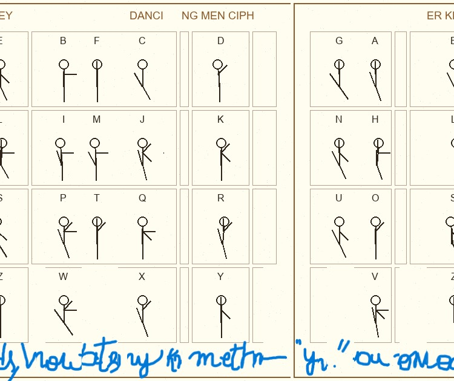

# 🎞️ Dancing Men

**Category:** Miscellaneous | **Difficulty:** Medium | **Status:** 🔄 Pending

---

## 📋 Challenge Overview

- Challenge combining file forensics, image reconstruction, and archive extraction.

---

## 🎯 Challenge Approach

**Goal:** Decode the Dancing Men cipher

**Key Techniques:**
- Cipher pattern recognition
- Dancing Men substitution
- Text analysis

---

## 🔍 Solution

- As Challenge was given with Two zip files 
- First ZIP File was contained encoded message and broken zip using a Dancing men substituion
- Second ZIP File was contained with shattered images of decrytion image for the Dancing men 
- Run binwalk on the files and found that broken zip has flag.txt which is protected with password - It hides in the message
- To confirm that I ran hexdump for verfication of zip 
- To unzip I need the reconstructed jpeg

- **Image Reconstruction**:
        
    - I uploaded them to claude to reconstruct the image from shatter 
    - It gave the developed image shown down ☝️
        

  - Decoded to obtain the message using the reversed shattered image : `THATS_SDIU_NURDY_STAFF`
  - WHich I guessed it would : `THATS_SOME_NERDY_STUFF`
  - Used this as the password to extract `notsoimportant.zip`
  - Retrieved the flag from within the ZIP archive from flag.txt

## Tools Used  

- hexdump – Binary file analysis and ZIP signature location
- binwalk - To extract and to view 
- 7-Zip – Password-protected archive extraction
- Claude - For Image Reconstruction

--

## 🏁 Final Flag

```
root{3l3m3n74ry_my_d34r_w47s0n}
```

---

<div align="center">

**[← Back to Home](../README.md)** | **[← Previous](../Forensics/REDACTED-Writeup.md)** | **[Next →](Flashes-Writeup.md)**

**Miscellaneous** 

*Last Updated: February 9, 2026*

</div>
